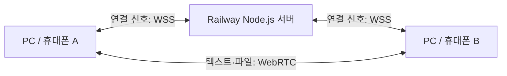

# QuickDrop 전체 프로젝트 정리

최종 정리일: **2026-10-09 (Asia/Seoul)**

QuickDrop은 앱 설치와 로그인 없이 두 기기를 QR 또는 6자리 코드로 연결해 텍스트·링크·사진·파일을 양방향으로 보내는 웹 서비스입니다.

- 서비스: **https://dropgo.up.railway.app**
- GitHub: [Ch-wook/QuickDrop](https://github.com/Ch-wook/QuickDrop), `main`
- 배포: Railway `quickdrop` / `production`, GitHub 푸시 자동 배포
- 최신 기능 변경: 이전 상대별 대화방 목록·이름 저장·연결 전 기록 열람, 다른 상대와 연결 중에도 과거 기록 보존. [대화방 구성](./HISTORY_ROOMS.md), [연결 복구](./RELIABILITY.md)
- 상세 운영 확인: [DEPLOYMENT.md](./DEPLOYMENT.md), [VALIDATION.md](./VALIDATION.md)

## 현재 운영 상태

대화방 목록·이름 저장·연결 전 기록 열람 코드 `9abc725`의 GitHub 푸시·Railway 배포 성공과 공개 자산 일치를 확인했습니다. 로컬 단위·통합 **92개**, 운영 빌드 E2E **17개 통과/7개 skip**, 공개 Chromium·Firefox E2E **4개 통과**입니다. 상세 결과는 [DEPLOYMENT.md](./DEPLOYMENT.md)에 있습니다. 아래는 앞선 연결 복구 버전의 배포 확인입니다.

2026-10-09 연결 안정성·기기별 기록 변경 `7b7d6e5`의 공개 배포와 새 자산 일치를 확인했습니다. 단위·통합 **92개**, 운영 빌드 E2E **14개**, 공개 Chromium·Firefox E2E **4개**가 통과했습니다. 네이버 검색 수집 알림은 2026-10-06에 접수한 기록이며 실제 검색 노출은 아직 확인하지 않았습니다.

| 항목 | 상태 |
|---|---|
| 공개 서비스 | `/api/health` 정상, `ok: true` |
| QR에 사용할 공개 주소 | `/api/config`의 `publicUrl`이 `https://dropgo.up.railway.app`과 일치 |
| 파일당 최대 크기 | 운영 API에서 209,715,200바이트(200MiB) 확인 |
| 수신 보관·예약 합계 | 운영 API에서 209,715,200바이트(200MiB) 확인 |
| 구현·배포·GitHub 연동 | 완료; `main` 푸시 자동 배포 확인 |
| 검색 접근 | 검색용 설정 배포 및 네이버 수집 알림 접수 완료; 실제 노출은 미확인 |
| 짧은 주소 변경 | 현재 주소 유지; Railway 설정 권한과 사용 가능 이름 확인 필요 |

## 사용 흐름

1. 두 PC 또는 PC·휴대폰에서 서비스 주소를 엽니다.
2. 휴대폰 카메라로 PC 화면의 QR을 스캔합니다. 두 기기에서 사이트를 열고 6자리 코드로 연결할 수도 있습니다.
3. 연결 완료 후 어느 기기에서든 텍스트를 보내거나 파일을 선택합니다.
4. 받은 파일은 다운로드합니다. 연결 중에는 두 기기의 페이지를 열어둡니다.
5. ‘이전 대화방’에서 과거 상대의 기록을 다시 열고 이름을 저장합니다. 다른 상대와 연결했다가 같은 브라우저끼리 다시 연결하면 해당 방을 이어갑니다.

과거 휴대폰 접속 거부는 QR이 PC의 `localhost`를 가리키던 문제였습니다. 이제 공개 HTTPS 주소로 QR을 생성하며 사용자가 휴대폰 연결 성공을 알려왔습니다. 휴대폰 OS별 파일 저장·백그라운드 동작까지 확인한 것은 아닙니다.

## 구현한 기능

| 구분 | 구현 내용 |
|---|---|
| 연결 | 임시 Room, QR, 6자리 코드, 최대 두 기기, HTTPS/WSS |
| 전송 | 텍스트·링크·이미지·일반 파일, 양방향 WebRTC DataChannel |
| 편의 기능 | 다중 파일 선택, 드래그·드롭, 이미지·파일 붙여넣기, 미리보기, 다운로드 |
| 상태 관리 | 진행률, 수신 확인, 취소, 자동 재접속·재협상, 기기별 대화방 목록·이름·복원·삭제 |
| 화면 | 한국어 반응형 UI, 키보드 조작, 모바일 레이아웃 |
| 운영 | Docker 빌드, healthcheck, GitHub 자동 배포, 정적 파일 압축·캐시 |
| 검색 | 한국어 제목·설명, canonical, Open Graph, robots.txt, 홈페이지 사이트맵, 네이버 IndexNow 제출 명령 |

## 구성과 데이터 흐름



서버는 Room과 연결 신호를 관리하고 파일·텍스트 본문은 WebRTC로 전송합니다. 별도 회원 DB나 파일 저장소는 없습니다. Room은 서버 메모리에 있어 재시작 후 새 연결이 필요합니다. 전송 기록과 받은 파일은 각 브라우저의 IndexedDB에 저장하며 같은 상대와 다시 연결하면 복원합니다.

| 위치 | 역할 |
|---|---|
| `client/` | React 화면, WebRTC 연결, 전송 큐·진행률·기록 |
| `server/` | Express API, WebSocket, Room, 요청 제한, 운영 정적 파일 |
| `shared/` | 공통 메시지·청크 규격과 URL 검증 |
| `public/`, `index.html` | favicon, 검색 메타데이터·사이트맵·소유 증명 파일 |
| `scripts/` | 모바일 개발 터널, 압축, 배포 검증, 검색 수집 알림 |
| `tests/` | 단위·통합 검사와 실제 브라우저 전송 검사 |
| `Dockerfile`, `railway.json`, `compose.yaml` | 빌드·실행·배포 구성 |

기술 구성: React 19, TypeScript, Vite, Node.js 24, Express 5, ws, Zod, Vitest, Playwright. 파일별 역할과 API는 [PROJECT_STRUCTURE.md](./PROJECT_STRUCTURE.md)에 정리했습니다.

## 용량과 보호 장치

- 파일당 **200MiB = 209,715,200바이트**. 화면에서는 기존 단위 표기에 맞춰 `200.0 MB`로 표시합니다.
- 한 기기의 수신 파일 보관·진행 중 예약 용량 합계는 **200MiB**를 유지합니다. 큰 파일을 추가로 받기 전에는 기존 파일을 저장하고 기록을 비워야 할 수 있습니다.
- 파일 큐 20개, 기록 300개, 활성 수신 파일 2개, Room 최대 두 기기.
- 브라우저 기록은 대화방당 300개, 받은 파일 합계 200MiB까지 보관합니다. 새 기기와 연결해도 기존 대화방을 자동 삭제하지 않습니다. 사이트 데이터 삭제·시크릿 모드·도메인 변경 시에는 기록을 유지할 수 없습니다.
- 파일을 최대 256KiB씩 읽고 16KiB 청크로 전송하며 송신 버퍼가 차면 기다립니다.
- 같은 origin 확인, 메시지 형식·크기 검증, IP별 요청 제한, 만료 Room 정리와 연결 heartbeat를 적용했습니다.
- QR·연결 코드를 아는 사람이 참가할 수 있습니다. 개인 참가 URL은 검색 제외 헤더를 반환하고 사이트맵·검색 제출에서 제외합니다.

## 최적화 및 검증

QR 라이브러리 지연 로딩으로 초기 JS gzip 예상 크기를 115.98kB에서 약 106.79kB로 줄였습니다. 파일 읽기를 묶고 중간 복사를 줄였으며, Brotli/gzip 사전 압축과 해시 자산 캐시를 적용했습니다. 상세 수치와 측정 범위는 [OPTIMIZATION.md](./OPTIMIZATION.md)를 참고하세요.

2026-10-09 대화방 확장 후 운영 빌드 E2E는 **17개 통과/7개 skip**입니다. 대화방 이름 유지, 연결 전 기록 열람, 다른 상대 연결 중 열람과 방별 삭제, 기존 DB 이전·12개 방 보존도 검사했습니다. PC 간 양방향 파일, 파일 선택 창 이벤트, WebSocket 단절 중 전송 유지, 실제 채널 종료 후 복구, 재연결·새로고침 후 기록/파일 복원, 다른 상대 기록 분리, 영구 삭제, 저장 기능 차단·용량 부족 시 전송 지속을 확인했습니다. 아래 86개 및 공개 E2E 기록은 이전 배포의 검사입니다.

2026-10-06 단위·통합 검사 **86개**와 운영 빌드가 통과했습니다. 운영 서버의 200MiB 제한·검색 설정·자산 일치를 확인했고 공개 Chromium·Firefox QR/전송 E2E **2개**가 통과했습니다. 200MiB 경계 허용·1바이트 초과 거절·수신 예약 해제는 전체 파일을 할당하지 않는 제한 검사이며 실제 휴대폰의 200MiB 전송 완료를 의미하지 않습니다. 상세 근거는 [VALIDATION.md](./VALIDATION.md)에 기록합니다.

## 배포와 검색 운영

Railway 서비스는 한 개의 Node.js 프로세스로 프런트엔드·API·WebSocket을 제공합니다. Room이 메모리에 있으므로 replica는 1개로 유지합니다. `PUBLIC_URL`과 실제 HTTPS 주소가 일치해야 합니다.

로컬 개발은 Node.js 22.12 이상에서 다음 명령으로 시작합니다. `http://localhost:3000`은 같은 PC의 브라우저 테스트용이며, 실제 기기 간 사용에는 위 공개 HTTPS 주소를 엽니다.

```sh
npm ci
npm run dev
```

코드를 변경한 뒤 검사하고 운영 반영을 확인할 때:

```powershell
npm test
npm run build
$env:EXPECTED_MAX_FILE_SIZE = '209715200'
npm run deploy:verify -- https://dropgo.up.railway.app
Remove-Item Env:EXPECTED_MAX_FILE_SIZE
```

검색 접근은 추가 비용 없이 기존 주소로 준비했고 네이버 IndexNow의 **HTTP 200 접수 응답**을 확인했습니다. 수집 알림 접수와 실제 검색 결과 노출은 별개입니다. Google 계정 소유권 확인·수동 색인 요청은 별도이며 검색 시점·순위는 보장하지 않습니다. 후속 절차는 [SEARCH.md](./SEARCH.md)에 있습니다. 도메인 구매는 하지 않았습니다.

## 남은 확인과 확장 범위

- 짧은 Railway 주소의 사용 가능 여부 확인과 변경. 무료 주소의 `up.railway.app`은 고정이며 `1.railway.app`을 할당할 수는 없습니다. 요청한 `go.up.railway.app`의 허용 여부·중복 여부는 아직 확인되지 않았고, CLI 인증 제한으로 현재 도메인은 변경하지 않았습니다. [Railway 도메인 규격](https://docs.railway.com/networking/domains/working-with-domains)
- 실제 iPhone/Android에서 파일 저장, 200MiB 전송, 장시간·백그라운드 동작 확인.
- 서로 다른 통신망의 연결 성공률 개선을 위한 운영 TURN 서버 연결과 인증 만료 검증. 현재 공개 설정에는 STUN만 있어 일부 NAT/방화벽에서 연결이 실패할 수 있습니다.
- 검색엔진의 실제 수집·노출 확인, 선택적으로 Google Search Console 소유권 확인.
- 로컬 Docker Compose 검사와 운영 모니터링 설정.

기기별 기록 보관과 대화방 목록·이름 저장·연결 전 열람을 추가했습니다. 신뢰 기기 자동 참가, PWA, 세 대 이상 연결, 오프라인 전송, 푸시 알림, 전송 중 청크 재개는 미구현입니다.

## 문서 안내

- [README.md](./README.md): 서비스와 개발 실행 방법
- [PROJECT_STRUCTURE.md](./PROJECT_STRUCTURE.md): 전체 파일·API·프로토콜 구성
- [PROJECT_STATUS.md](./PROJECT_STATUS.md): 구현·수정 이력과 후속 작업
- [VALIDATION.md](./VALIDATION.md): 검사 근거와 미검증 범위
- [DEPLOYMENT.md](./DEPLOYMENT.md): 배포 식별자·설정·복구 절차
- [OPTIMIZATION.md](./OPTIMIZATION.md): 성능 개선 내역과 측정
- [SEARCH.md](./SEARCH.md): 검색 노출 준비·요청 결과
- [RELIABILITY.md](./RELIABILITY.md): 연결 자동 복구·PC끼리 사용·기기별 기록
- [HISTORY_ROOMS.md](./HISTORY_ROOMS.md): 이전 상대별 대화방, 방 이름과 보관 범위
