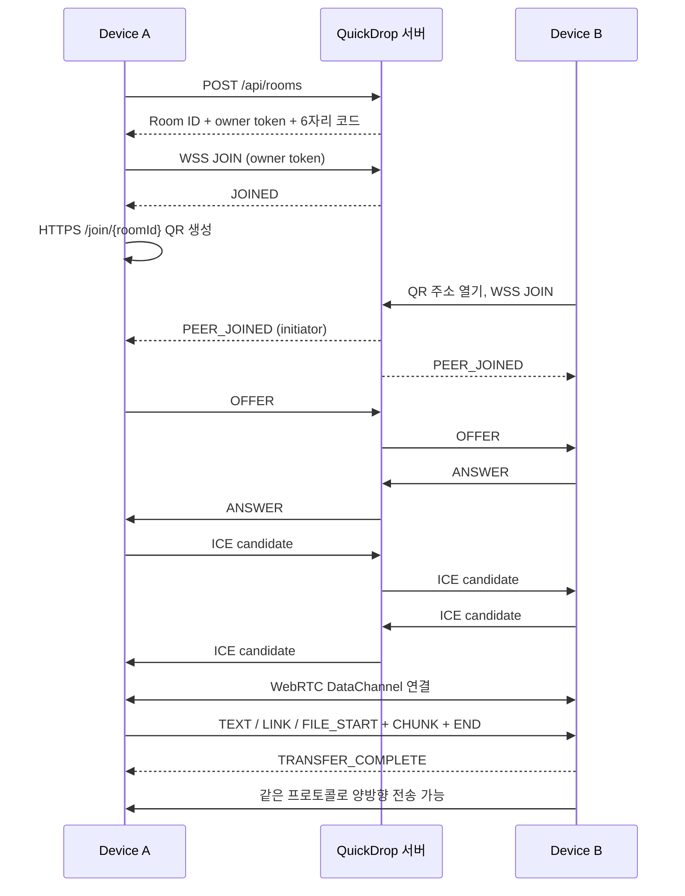

# QuickDrop 전체 프로젝트 구성

## 1. 서비스 개요

QuickDrop은 웹사이트와 QR 또는 연결 코드로 **동등한 두 기기**를 연결해 텍스트·URL·이미지·일반 파일을 양방향 전송하는 서비스입니다.

계정, 로그인, 앱 설치, 메시지/파일 영구 저장 없이 동작합니다. 전송하려는 두 기기에서 브라우저를 열어두어야 합니다. 서버는 연결을 중개하고 전송 내용은 WebRTC DataChannel을 사용합니다.

## 2. 기술 구성

| 영역 | 기술 | 역할 |
|---|---|---|
| 언어 | TypeScript | 프런트/서버/프로토콜 타입 공유 |
| 화면 | React 19, CSS | 한국어 반응형 UI, 세션 내 전송 기록 |
| 프런트 빌드 | Vite 7 | 개발 화면, production 정적 파일 생성 |
| 서버 | Node.js, Express 5 | Room API, 설정 API, 정적 파일 제공 |
| 연결 중개 | ws | WebSocket / secure WebSocket signaling |
| 실제 전송 | WebRTC RTCDataChannel | 암호화된 텍스트·파일 양방향 전송 |
| 입력 검증 | Zod | signaling 및 transfer 메시지 schema |
| QR | qrcode | HTTPS 참가 링크 이미지 생성 |
| 검증 | Vitest, Playwright, jsQR, pngjs | 단위·통합·실제 브라우저·QR 해독 테스트 |
| 배포 | Docker, Compose, Railway 설정 | 단일 Node 프로세스 운영 |
| 휴대폰 개발 확인 | Cloudflare Quick Tunnel | 임시 HTTPS/WSS 접속 주소 |

## 3. 폴더와 파일

```text
QuickDrop/
├─ client/
│  ├─ main.tsx                 React mount와 CSS import
│  ├─ App.tsx                  기기 연결, QR, 코드 입력, 전송 UI
│  ├─ peer.ts                  WebSocket 및 RTCPeerConnection 수명 관리
│  ├─ transfers.ts             파일 대기열, 청크, ACK, 취소, 수신 메모리
│  ├─ TransferCard.tsx         텍스트/링크/이미지/파일 기록 카드
│  ├─ icons.tsx                프로젝트 내부 SVG 아이콘
│  └─ styles.css               반응형 스타일과 상태별 표현
├─ server/
│  ├─ index.ts                 개발/운영 서버 진입점, 종료 처리
│  ├─ app.ts                   API, WS upgrade, origin 검사, heartbeat
│  ├─ config.ts                환경 변수 읽기, 범위와 PUBLIC_URL 검증
│  ├─ ice.ts                   coturn REST 임시 인증정보 발급, 비밀키 서버 보관
│  ├─ static.ts                사전 압축 파일 협상, 자산 캐시, HTML 재검증
│  └─ rooms.ts                 Room 생성/참가/삭제/TTL, rate limiter
├─ shared/
│  ├─ protocol.ts              메시지 타입/schema, chunk framing/조립
│  └─ connection-url.ts        휴대폰 QR에 쓸 수 있는 URL 판별
├─ scripts/
│  ├─ mobile.mjs               HTTPS 터널 + production 서버 실행/정리
│  ├─ mobile-health.mjs        로컬 세션 일치 및 공개 HTTPS 상태 검사
│  ├─ mobile-status.mjs        npm run mobile:status 명령
│  ├─ compress-assets.mjs      JS/CSS Brotli/gzip 사전 압축
│  ├─ verify-deployment.mjs    공개 서버와 로컬 빌드 해시·내용·캐시 비교
│  └─ cloudflared-release.json 고정된 공식 도구 버전과 SHA-256
├─ tests/
│  ├─ rooms.test.ts            Room 수명, 2 Peer 제한, rate limit
│  ├─ protocol.test.ts         메시지, URL, 파일명, chunk 조립
│  ├─ transfers.test.ts        전송 상태/ACK/취소/용량/타임아웃
│  ├─ server.test.ts           실제 HTTP/WS, origin, TTL, canonical URL
│  ├─ ice.test.ts              TURN 인증 만료·서명·독립성·비밀키 비노출
│  ├─ peer.test.ts             인증 갱신·타임아웃·종료 후 비동기 처리
│  ├─ static.test.ts           압축 응답 원본 비교·캐시·HEAD·304·경로 검사
│  ├─ connection-url.test.ts   loopback/HTTP/HTTPS 주소 회귀 테스트
│  ├─ mobile-health.test.mjs   종료/오래된 주소/DNS 실패 회귀 검사
│  └─ e2e/
│     ├─ quickdrop.spec.ts     같은 엔진 두 컨텍스트의 전송 전체 흐름
│     ├─ interoperability.spec.ts Chromium ↔ Firefox 실제 전송
│     └─ mobile.spec.ts        공개 HTTPS QR → WSS → WebRTC 전송
├─ public/favicon.svg
├─ index.html                 SPA HTML 진입점
├─ package.json / package-lock.json
├─ tsconfig.json              TypeScript strict 설정
├─ vite.config.ts             React 빌드 및 dist/client 출력
├─ vitest.config.ts           단위/통합 테스트 선택
├─ playwright.config.ts       로컬 또는 외부 HTTPS E2E 실행
├─ Dockerfile                 빌드 단계와 non-root 실행 단계
├─ compose.yaml               로컬 컨테이너 실행
├─ railway.json               Docker 빌드, healthcheck, 1 replica 배포
├─ .env.example               환경 변수 예시
├─ .gitignore / .dockerignore
├─ README.md                  사용/개발/운영 설명
├─ PROJECT_STRUCTURE.md       이 문서
├─ PROJECT_STATUS.md          진행 현황, 수정 이력, 남은 작업
├─ DEPLOYMENT.md              실제 운영 주소, 배포·검증·복구
├─ OPTIMIZATION.md            성능 측정과 최적화 기록
└─ VALIDATION.md              실제 검증 결과와 미검증 범위
```

자동 생성되며 Git에 올리지 않는 파일:

| 경로 | 내용 |
|---|---|
| `node_modules/` | 설치한 의존성 |
| `dist/client/` | 프런트 production 빌드 |
| `dist/server/index.js` | 서버 bundle |
| `.env` | 실제 환경 변수와 secret |
| `.tools/` | checksum 검증한 cloudflared 실행 파일 |
| `.quickdrop/mobile.json` | 현재 임시 HTTPS 주소, 프로세스 식별자 |
| `.quickdrop/mobile.log` | 개발 터널 실행 로그 |
| `artifacts/`, `test-results/` | 화면 이미지, trace 등 테스트 결과 |

## 4. 연결과 자료 이동



첫 참가자가 offer를 만드는 것은 연결 협상 역할일 뿐입니다. 두 Peer 모두 동일하게 송신·수신합니다. PC/휴대폰에 따른 역할 분기는 없습니다.

서버에 저장하는 정보는 메모리의 Room ID, 코드, 만료 시각, Peer/WebSocket뿐입니다. 자료 업로드 API나 파일 저장소는 없습니다. TURN을 설정한 경우 일부 전송은 암호화된 상태로 TURN을 경유할 수 있습니다.

## 5. HTTP 및 WebSocket 인터페이스

| 경로 | 동작 |
|---|---|
| `GET /` | 연결 시작 화면 |
| `GET /join/:roomId` | 특정 Room 참가 화면 |
| `GET /api/health` | `{ "ok": true }`, 운영 healthcheck |
| `GET /api/config` | 공개 URL, 크기 제한, ICE 설정 |
| `POST /api/rooms` | 임시 Room 생성; 같은 origin, rate limit 적용 |
| `WS(S) /ws` | 검증된 signaling 메시지 중계 |

`PUBLIC_URL`이 설정되어 있으면 로컬/다른 주소로 연 페이지를 정식 HTTPS 주소로 이동합니다. Room 참가 경로는 유지합니다. API는 이 이동 처리에서 제외합니다.

WS 메시지: `JOIN`, `JOINED`, `PEER_JOINED`, `OFFER`, `ANSWER`, `ICE_CANDIDATE`, `PEER_LEFT`, `ROOM_EXPIRED`, `ERROR`.

## 6. 파일 전송 구성

- 파일 chunk payload는 16KiB이며 한 번에 전체 파일을 `send()`하지 않습니다.
- 바이너리 프레임: UUID ASCII 36 bytes + sequence uint32 4 bytes + payload.
- 송신 버퍼가 1MiB를 초과하면 backpressure에 따라 기다립니다.
- 수신자는 transfer ID, 순서, 총 크기를 확인하고 Blob을 만듭니다.
- 수신 확인 ACK가 도착해야 송신 측에서도 완료 상태로 바뀝니다.
- 전송 상태: `sending → confirming → complete`, `receiving → complete`, 오류/취소 시 `error` 또는 `cancelled`.
- 파일당 기본 100MiB, 수신 보관 합계 200MiB, 기록 300개, 대기열 20개 제한.
- 기록 비우기/새 세션/종료 시 Blob URL과 수신 메모리를 해제합니다.
- JPEG/PNG/WebP만 이미지로 preview하며 다른 파일은 사용자 클릭으로 다운로드합니다.

## 7. 휴대폰 QR 접속 거부 원인과 수정

### 원인

기존에는 PC에서 `http://localhost:3000`으로 접속하면 QR에도 이 주소가 포함됐습니다. 휴대폰의 `localhost`는 휴대폰 자신이므로 PC 서버에 도달하지 못해 연결이 거부됩니다. 서버가 정상이어도 발생합니다. IP로만 바꾸면 HTTPS/secure context와 방화벽 문제도 별도로 남습니다.

### 수정

1. localhost, 127.x.x.x, `::1`, wildcard 주소를 휴대폰 QR 대상에서 제외.
2. HTTPS가 아닌 LAN/공개 주소도 QR 대신 연결 환경 안내 표시.
3. 같은 PC 테스트는 별도 연결 링크로 유지.
4. `npm run dev:mobile`로 공식 cloudflared 다운로드/검증, 임시 HTTPS 터널, production 서버를 함께 실행.
5. `PUBLIC_URL` 검증과 canonical HTTPS redirect로 PC와 휴대폰이 같은 origin 사용.
6. 공개 HTTPS에서 QR 해독 → WSS 연결 → 실제 WebRTC 텍스트/파일 수신까지 자동 검증.

## 8. 실행 모드

### 같은 PC에서 개발

```sh
npm install
npm run dev
```

주소: `http://localhost:3000`. localhost에서는 휴대폰 QR을 표시하지 않습니다. 코드 또는 이 PC의 다른 창 연결 링크로 두 브라우저를 테스트합니다.

### 휴대폰에서 즉시 확인

```sh
npm run dev:mobile
```

표시되는 `https://...trycloudflare.com`을 **PC에서 먼저 열고**, 그 화면의 QR을 휴대폰에서 스캔합니다. `http://127.0.0.1:3001`도 현재 HTTPS 주소로 이동합니다. 기본 모바일 전용 포트는 3001이며 `MOBILE_PORT`로 변경할 수 있습니다.

이 방식은 임시 개발 접속입니다. PC와 프로세스가 켜져 있어야 하며 재실행마다 URL이 바뀝니다. 최초 실행에는 공식 GitHub release 다운로드가 필요합니다. 프런트 소스나 Vite 개발 서버를 공개하지 않고 production 결과만 제공합니다. Cloudflare는 웹/연결 중개 트래픽을 처리하지만 파일 payload는 여전히 WebRTC를 사용합니다.

`npm run mobile:status`로 로컬 서버와 공개 HTTPS의 실제 응답을 확인합니다. 실행 정보 파일만 남은 경우를 정상 실행으로 간주하지 않습니다. 실행 중에는 30초 간격으로 확인하고 실패/복구 시 알립니다.

### 상시 운영 배포

```sh
npm run build
npm start
# 또는
docker compose up --build -d
```

Railway에는 GitHub 저장소를 연결하고 `railway.json` + `Dockerfile`로 배포하도록 준비했습니다. 기본 제공 HTTPS 도메인을 사용하며 `PUBLIC_URL`에 실제 발급 주소, `TRUST_PROXY=1`, `HOST=0.0.0.0`을 설정합니다. 앱의 Room은 메모리 상태이므로 **replica는 1개**로 유지합니다. 호스팅 계정 연결/실제 도메인 발급/배포 확인이 끝나야 상시 서비스입니다. 임시 터널을 상시 배포 완료로 간주하지 않습니다.

## 9. 주요 환경 변수

| 변수 | 기본값/설명 |
|---|---|
| `PORT` / `HOST` | 3000 / 0.0.0.0; 호스팅이 제공하는 PORT 사용 가능 |
| `PUBLIC_URL` | 두 기기에서 접속할 HTTPS origin; localhost/HTTP 값은 거부 |
| `ROOM_TTL` | 600000ms; 2 Peer 미만 대기 Room TTL |
| `MAX_FILE_SIZE` | 104857600 bytes |
| `MAX_SESSION_BYTES` | 209715200 bytes |
| `STUN_URL` | 기본 Google STUN; 빈 값이면 비활성 |
| `TURN_URL`, `TURN_USERNAME`, `TURN_PASSWORD` | 선택적인 TURN 연결 설정 |
| `TRUST_PROXY` | 기본 0; 정확한 reverse proxy hop 수 |
| `JOIN_RATE_LIMIT` | IP당 분당 10회 |
| `MOBILE_PORT` | `dev:mobile` 전용 포트, 기본 3001 |
| `E2E_PRODUCTION` | 테스트 서버를 production 모드로 실행 |
| `E2E_BASE_URL` | 지정한 실제 HTTPS 배포 주소에 mobile E2E 실행 |

`/api/config`의 TURN credential은 브라우저에 제공됩니다. 공개 운영에는 장기 공용 비밀번호 대신 단기 credential 발급을 적용해야 합니다.

## 10. 테스트와 배포 확인

```sh
npm run check
npm test
npm run build
npx playwright install chromium firefox webkit
npm run test:e2e
```

공개 HTTPS 테스트(PowerShell):

```powershell
$env:E2E_BASE_URL = 'https://실제-배포-주소'
npm run test:e2e -- --project=chromium
Remove-Item Env:E2E_BASE_URL
```

`mobile.spec.ts`는 QR 이미지의 실제 내용과 origin, WSS 사용, 두 Peer 연결, 텍스트 및 파일의 바이트 일치를 확인합니다. 로컬 모드는 loopback QR이 표시되지 않는 회귀 테스트를 포함합니다. Windows WebKit의 WebRTC 미지원 범위와 실제 실행 결과는 [VALIDATION.md](./VALIDATION.md)에 기록합니다.

## 11. 보안·운영 경계

- HTTPS/WSS, same-origin, strict schema, payload 크기 제한, IP/메시지 rate limit.
- 192-bit Room ID, 별도 owner token, 6자리 fallback 코드, 2 Peer 제한과 TTL.
- XSS escaping, HTTP(S) URL만 링크 활성화, 안전한 파일명, 자동 파일 실행 없음.
- QR/코드를 아는 사람은 참가할 수 있습니다. 별도 사용자 인증은 없습니다.
- 서버 재시작, 새로고침, 새 연결 시 복구하지 않습니다.
- 모바일 백그라운드나 NAT/방화벽 환경에서는 전송 실패 가능성이 있습니다.
- 계정·기기 기억·PWA·3대 이상·오프라인 보관·push·전송 resume는 미구현입니다.
- 향후 우선순위는 실제 iPhone/Android/통신망 QA, TURN 단기 credential, 대용량 스트리밍/전송 재개입니다.

## 12. 참고

- [README](./README.md): 실행·기능·환경 설정
- [검증 기록](./VALIDATION.md): 실제 통과 결과와 제한
- [Cloudflare Quick Tunnels](https://developers.cloudflare.com/cloudflare-one/networks/connectors/cloudflare-tunnel/do-more-with-tunnels/trycloudflare/): 임시 HTTPS 개발 주소
- [Railway Public Networking](https://docs.railway.com/networking/public-networking): 호스팅 HTTPS 도메인
