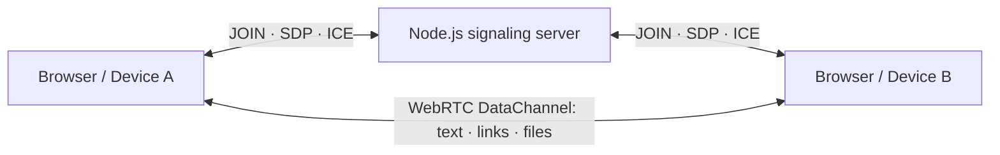

# QuickDrop

웹사이트 열기 → QR 스캔 → 연결 → 보내기.

앱 설치, 계정, 로그인 없이 두 브라우저 사이에서 텍스트·링크·이미지·파일을 양방향 전송하는 MVP입니다. PC, 휴대폰, 태블릿은 모두 동등한 Peer입니다. 자료를 자기 기기로 옮기기 위해 메신저나 클라우드에 업로드할 필요가 없습니다.

## 실행

지금까지의 구현 현황과 남은 작업은 [PROJECT_STATUS.md](./PROJECT_STATUS.md), 전체 구성은 [PROJECT_STRUCTURE.md](./PROJECT_STRUCTURE.md), 검사 결과는 [VALIDATION.md](./VALIDATION.md)를 참고하세요.

서비스 주소: **https://dropgo.up.railway.app**. 2026-10-06 최적화본 배포를 완료했으며 Chromium·Firefox에서 공개 QR 연결과 실제 텍스트·파일 전송을 검증했습니다. 배포 기록은 [DEPLOYMENT.md](./DEPLOYMENT.md), 개선 내용과 수치는 [OPTIMIZATION.md](./OPTIMIZATION.md)에 있습니다.

Node.js **22.12 이상**(개발 검증: Node 24)을 설치한 뒤:

```sh
npm install
npm run dev
```

<http://localhost:3000>을 엽니다. HTTP, 프런트엔드, WebSocket을 하나의 명령과 포트로 실행합니다. 첫 브라우저가 자동으로 Room과 6자리 코드를 만듭니다. localhost에서는 휴대폰용 QR 대신 로컬 접속 안내를 표시합니다. 같은 컴퓨터에서는 시크릿 창에서 연결 링크를 열거나 코드를 입력해 확인할 수 있습니다. QR은 두 기기에서 사용할 HTTPS 주소로 접속하면 나타납니다.

```sh
# 선택 사항: 환경 설정 파일을 복사하고 수정
cp .env.example .env
# PowerShell에서는 Copy-Item .env.example .env

# 프로덕션 빌드와 실행
npm run build
npm start
```

### 실제 휴대폰에서 연결

휴대폰의 `localhost`는 휴대폰 자신을 뜻합니다. PC의 localhost QR을 휴대폰에서 열 수는 없습니다. **두 기기에서 접근 가능한 HTTPS 주소**를 사용하세요.

가장 빠른 개발 확인 방법:

```sh
npm run dev:mobile
```

production 빌드 후 공식 cloudflared를 SHA-256 검증하여 준비하고, 서버와 임시 HTTPS 터널을 함께 실행합니다. 출력된 HTTPS 주소를 **PC에서 먼저 연 뒤 그 화면의 QR을 휴대폰으로 스캔**하세요. `http://127.0.0.1:3001`도 현재 HTTPS 주소로 이동합니다. PC/프로세스를 종료하면 접속이 끊기고 재실행마다 주소가 바뀝니다. 상시 배포를 대신하는 기능은 아닙니다. 다운로드 파일과 터널 주소/로그는 Git에 포함되지 않습니다.

임시 접속 상태 확인:

임시 주소가 열리지 않으면 다른 터미널에서 `npm run mobile:status`를 실행하세요. 로컬 서버 중지, 오래된 주소, 공개 DNS/네트워크 오류를 구분합니다. `ready`인 경우에만 현재 주소를 출력합니다. 실행 중에는 30초마다 접속 상태를 확인하고 실패/복구 시 터미널에 알립니다.

고정된 HTTPS 서비스를 구성하는 순서:

1. 서버 앞에 HTTPS reverse proxy를 설정하거나, 본인이 신뢰하는 HTTPS 개발 터널을 연결합니다.
2. `.env`에 `PUBLIC_URL=https://접근가능한주소`를 설정하고 서버를 다시 실행합니다.
3. PC도 그 HTTPS 주소로 접속합니다. PC 화면의 QR을 휴대폰 카메라로 스캔합니다.
4. 양쪽에 연결 완료가 표시되면 어느 쪽에서든 보낼 수 있습니다.

프록시는 `/ws`의 WebSocket Upgrade를 전달하고 idle timeout을 60초 이상으로 설정해야 합니다. 프록시가 하나일 때만 `TRUST_PROXY=1`을 설정하고, 앱 포트는 프록시에서만 접근하도록 제한하세요. 개발 서버의 외부 hostname 허용이 필요한 경우 `__VITE_ADDITIONAL_SERVER_ALLOWED_HOSTS=해당호스트`를 설정할 수 있습니다. 공개 배포에는 개발 서버 대신 production build를 사용하세요.

단순한 `http://192.168.x.x` 접속은 브라우저의 secure context 제한 때문에 지원하지 않습니다. HTTPS 또는 같은 컴퓨터의 localhost를 사용하세요.

## 구현한 기능

- 임시 Room 자동 생성, QR, 6자리 코드 fallback, 최대 2 Peer
- 참가 순서로 offer 생성자를 결정하는 WebRTC 연결
- TEXT/LINK 자동 판별, 텍스트 복사, HTTP(S) 링크 새 탭 열기
- 파일 선택, 다중 파일 대기열, 드래그 앤 드롭, 클립보드 이미지/파일 붙여넣기
- JPEG/PNG/WebP 미리보기와 모든 파일 형식의 Blob 다운로드
- 양방향 파일 청크 전송, 양쪽 진행률, 수신 확인 ACK, 취소, 오류/타임아웃 처리
- 브라우저 메모리에만 있는 세션 기록, 기록 비우기와 Blob URL 해제
- 대기 Room TTL, 마지막 Peer 퇴장 시 삭제, WebSocket heartbeat
- 반응형 한국어 UI, 버튼/입력 label, 키보드 조작, 상태 안내, dialog focus 복귀
- localhost/HTTP QR 방지, 휴대폰용 임시 HTTPS 실행, PUBLIC_URL canonical redirect

붙여넣은 텍스트와 URL은 입력창에 들어가고 사용자가 보내기를 누릅니다. 파일 선택·드롭·파일 붙여넣기는 연결된 Peer에게 즉시 전송합니다. Enter는 줄바꿈, Ctrl/⌘+Enter는 텍스트 전송입니다.

## 기술과 아키텍처

- **TypeScript + React + Vite**: 작은 반응형 UI와 브라우저 타입, 빠른 개발/정적 빌드
- **Node.js + Express + ws**: 정적 파일, Room API와 WebSocket을 단일 프로세스로 제공
- **네이티브 WebRTC RTCDataChannel**: 양방향 암호화된 실시간 데이터 전송
- **Zod**: 클라이언트/서버 공통 메시지 타입과 런타임 검증
- **Vitest + Playwright**: 단위·통합 테스트와 실제 브라우저 E2E
- DB, 계정 시스템, 클라우드 스토리지, 별도 상태관리 라이브러리 없음



서버는 Room 생성·참가·Peer discovery·SDP offer/answer·ICE 중계·Room 수명만 담당합니다. 내용 전송용 API나 업로드 엔드포인트가 없습니다. Room, 코드, 연결 상태도 서버 메모리에만 존재하며 서버 재시작 시 사라집니다. 서버는 자료나 SDP를 파일에 기록하지 않습니다.

STUN은 연결 경로 탐색을 돕습니다. **TURN이 없으면 다른 통신사, 기업 방화벽, 일부 NAT 환경에서는 연결에 실패할 수 있습니다.** TURN을 설정하면 직접 연결이 어려울 때 암호화된 WebRTC 패킷이 TURN을 경유합니다. 이 경우 직접 네트워크 경로는 아니지만 자료를 저장하는 업로드 서비스는 아닙니다. HTTP signaling 서버로 내용을 우회 전송하는 fallback은 없습니다.

## 폴더 구조

전체 파일별 역할, 연결 흐름, API, 실행 모드와 배포 구성은 [PROJECT_STRUCTURE.md](./PROJECT_STRUCTURE.md)에 정리했습니다.

```text
client/
  App.tsx             연결 화면, 입력/붙여넣기/드롭, 세션 UI
  TransferCard.tsx     텍스트·파일·이미지·진행률 UI
  peer.ts             WebSocket signaling, WebRTC lifecycle
  transfers.ts        ACK, 파일 큐, backpressure, 취소/메모리 관리
  icons.tsx           SVG 아이콘
  styles.css          데스크톱·모바일 스타일
server/
  index.ts            개발 Vite / 프로덕션 정적 서버 부트스트랩
  app.ts              API, WebSocket, origin/요청 검증, heartbeat
  rooms.ts            Room 수명, 2 Peer 제한, rate limiter
  config.ts           환경 변수 검증
shared/protocol.ts    공통 타입, Zod schema, URL/파일명, 청크 조립
tests/                단위·통합 테스트, e2e/
public/               favicon
Dockerfile / compose.yaml / .env.example
```

## 연결·전송 프로토콜

서버 메시지: `JOIN`, `JOINED`, `PEER_JOINED`, `OFFER`, `ANSWER`, `ICE_CANDIDATE`, `PEER_LEFT`, `ROOM_EXPIRED`, `ERROR`. 최초 생성자는 별도의 192-bit owner token으로 첫 슬롯을 확보합니다. 이후 Peer가 연결되면 **현재 참가 순서의 첫 Peer**가 offer를 생성합니다. 양쪽 모두 같은 전송 코드를 사용합니다.

DataChannel은 reliable/ordered 모드이며 다음 메시지를 교환합니다.

| 메시지 | 의미 |
|---|---|
| `TEXT`, `LINK` | UUID + 텍스트, HTTP(S)만 링크로 허용 |
| `FILE_START` | UUID + 정제할 파일명 + 크기 + MIME |
| `FILE_CHUNK` | 바이너리 프레임: UUID ASCII 36 bytes + uint32 big-endian 순서 4 bytes + payload |
| `FILE_END` | 전체 청크 송신 종료 |
| `TRANSFER_COMPLETE` | 수신자가 텍스트 수신 또는 파일 전체 조립을 확인 |
| `TRANSFER_CANCEL` | 양쪽 전송 취소 |
| `TRANSFER_ERROR` | 수신 제한/타임아웃 등 오류 |

파일은 최대 **256KiB**씩 묶어 읽고, 전송 payload는 **16KiB** 청크로 나눕니다. 각 청크의 40-byte 헤더를 포함해 브라우저 간 메시지 크기 차이를 보수적으로 처리합니다. `bufferedAmount`가 1MiB를 넘으면 기다리고 `bufferedamountlow` 이벤트와 종료/타임아웃을 확인합니다. 수신자는 순서·총 크기를 검사하고 완성된 Blob만 다운로드 가능하게 합니다. DataChannel의 암호화·무결성·reliable transport를 사용하며 별도 애플리케이션 파일 해시는 보내지 않습니다.

파일별/누적 수신 용량, 대기열 20개, 기록 300개, 활성 수신 파일 2개 제한으로 메모리 사용을 제한합니다. 완료된 수신 Blob은 기록을 비우거나 세션을 종료하면 해제됩니다. 전송 중 기록 비우기는 완료/실패/취소 기록만 지웁니다. 타임아웃은 60초이며 전송 재개는 지원하지 않습니다.

관련 구현 기준: [MDN WebRTC data channels](https://developer.mozilla.org/en-US/docs/Web/API/WebRTC_API/Using_data_channels), [Vite JavaScript API](https://vite.dev/guide/api-javascript).

## 환경 변수

`.env.example`에 예시가 있습니다. 실제 `.env`와 secret은 Git 및 Docker build context에서 제외합니다.

| 변수 | 기본값 | 설명 |
|---|---|---|
| `PORT` | `3000` | 로컬 서버 포트 / Compose 호스트 공개 포트 |
| `HOST` | `0.0.0.0` | 서버 listen 주소 |
| `PUBLIC_URL` | 현재 origin | QR 주소 및 허용 origin, 배포 시 HTTPS origin |
| `ROOM_TTL` | `600000` | 2 Peer 미만 대기 Room 유효 시간(ms), Peer 퇴장 시 다시 시작 |
| `MAX_FILE_SIZE` | `104857600` | 파일당 100MiB, 상한 1GiB |
| `MAX_SESSION_BYTES` | `209715200` | 보관 중 수신 파일과 진행 중 수신 예약 용량 합계 200MiB |
| `STUN_URL` | `stun:stun.l.google.com:19302` | STUN URL, 빈 값이면 비활성 |
| `TURN_URL` | 없음 | 선택 TURN URL, 여러 개는 쉼표 구분 |
| `TURN_USERNAME` | 없음 | 선택 TURN 사용자 |
| `TURN_PASSWORD` | 없음 | 선택 TURN credential |
| `TURN_SECRET` | 없음 | coturn REST 인증용 공유 비밀키, 최소 32자; 서버에만 보관 |
| `TURN_CREDENTIAL_TTL` | `3600` | 임시 TURN 인증 유효 시간(초), 600~86400 |
| `TRUST_PROXY` | `0` | 신뢰할 reverse proxy hop 수, 정확히 설정 |
| `JOIN_RATE_LIMIT` | `10` | IP당 분당 JOIN 시도, 기본값 유지 권장 |

두 Peer가 연결된 Room은 활동 중 유지됩니다. 한 Peer만 남으면 대기 TTL이 다시 시작하고, 둘 다 떠나면 즉시 삭제합니다. 비정상 종료는 15초 간격 ping/pong으로 탐지합니다. Room 총수 최대 10,000개, WebSocket 최대 20,000개이며 API/연결/메시지 횟수도 제한합니다. 동일 IP를 공유하는 기기에도 JOIN 제한이 함께 적용됩니다.

## 테스트

```sh
npm run check
npm test
npm run build
npx playwright install chromium firefox webkit
npm run test:e2e
# 특정 엔진만
npm run test:e2e -- --project=chromium
```

E2E는 3100번 포트에 별도 서버를 시작하고, 두 개의 격리된 브라우저 컨텍스트를 연결합니다. STUN을 끄고 로컬 ICE로 실제 WebRTC를 검증합니다. 테스트에서만 JOIN rate limit을 올립니다. 운영 기본값은 10회/분입니다. 실패 시 `test-results/`에 screenshot/trace, 화면 검증 이미지는 `artifacts/`에 생성됩니다.

빌드 후 `E2E_PRODUCTION=1 npm run test:e2e`로 production 서버에서도 같은 검사를 수행할 수 있습니다. PowerShell에서는 `$env:E2E_PRODUCTION='1'` 설정 후 실행하고 끝나면 `Remove-Item Env:E2E_PRODUCTION`으로 해제합니다.

- Room 생성, 잘못된 참가, 2 Peer 제한, TTL/삭제
- Origin 검사, 실제 WebSocket offer/answer/ICE 전달, 세 번째 Peer 거부, rate limit
- 메시지/파일 metadata 검증, URL 판별, 파일명 정제, 바이너리 청크 순서와 조립
- ACK 전/후 상태, 취소, disconnect, 타임아웃, 용량 제한, Blob 내용
- 실제 DataChannel ping/pong, 양방향 텍스트, 링크 열기, 복사, 이미지/파일 전송 및 다운로드 byte 일치
- 드래그 앤 드롭, 이미지 paste, 코드 fallback, 연결 종료, 모바일 폭과 도움말 키보드 조작

검증 결과와 브라우저별 제한은 `VALIDATION.md`에 기록합니다. Playwright 엔진 검증은 실제 iPhone/Android 기기 검증을 대체하지 않습니다.

이 Windows 환경에서는 Chromium·Firefox 및 두 엔진 간 실제 전송을 검증했습니다. 설치된 Windows WebKit은 `RTCPeerConnection`을 제공하지 않아 해당 전송 테스트는 지원 여부를 확인한 뒤 skip하고, 오류 안내/모바일 UI만 검사합니다. Safari 전송은 macOS/실제 iPhone에서 추가 검증이 필요합니다.

## Docker

```sh
docker compose up --build -d
docker compose logs -f quickdrop
docker compose down
```

기본 주소는 <http://localhost:3000>입니다. 최종 이미지는 production dependencies와 빌드 결과만 포함하고, non-root 사용자·읽기 전용 파일시스템·healthcheck로 실행합니다. 볼륨이나 DB는 필요 없습니다. 실제 기기와 공개 배포에는 별도 HTTPS reverse proxy가 필요합니다. TURN은 외부 coturn/관리형 TURN을 `TURN_*` 변수로 연결하는 선택 구성입니다.

### Railway 상시 배포

`railway.json`에 Docker 빌드, `/api/health`, 재시작 정책과 1 replica 구성이 있습니다. GitHub 저장소를 연결하고 기본 HTTPS 도메인을 발급한 뒤 `PUBLIC_URL=https://발급된주소`, `TRUST_PROXY=1`, `HOST=0.0.0.0`을 설정하세요. 실제 배포에는 Railway 계정 연결과 해당 계정의 사용 가능 플랜이 필요합니다. 무료/체험 사용량과 과금 조건은 [Railway 공식 문서](https://docs.railway.com/pricing/free-trial)를 확인하세요.

## 브라우저 호환성과 제한

- 최신 Chrome/Edge/Firefox/Safari의 WebRTC, DataChannel, Blob, File API, HTTPS 환경을 대상으로 합니다.
- 기본 카메라로 QR을 스캔하므로 웹사이트가 카메라 권한을 요구하지 않습니다.
- 클립보드 파일/이미지 붙여넣기는 OS·브라우저가 clipboard files를 제공할 때 동작합니다. 파일 첨부는 항상 대안입니다.
- 다운로드는 사용자의 클릭으로 시작합니다. iOS에서는 브라우저가 제공하는 다운로드/파일 저장 UI를 사용합니다.
- **두 기기가 페이지를 계속 열어두어야 합니다.** 모바일 백그라운드/절전으로 브라우저가 중단되면 전송이 실패할 수 있습니다.
- 새로고침/새 연결/서버 재시작 시 기록과 연결을 복구하지 않습니다. 실패한 전송은 다시 보내야 합니다. 상대가 다시 참가하면 새 DataChannel과 새 기록을 사용합니다.
- Blob은 수신 브라우저 메모리에 보관되며 실사용 메모리는 지정 용량보다 클 수 있습니다. 모바일에서는 큰 제한값을 권장하지 않습니다.
- 단일 Node 프로세스의 메모리 Room입니다. 다중 replica, 무중단 재연결, 분산 rate limit은 구현하지 않았습니다.

## 보안 고려사항

- Room ID 192-bit 랜덤 + 6자리 fallback 코드, 대기 TTL, IP별 JOIN 제한 및 서버 자원 상한
- QR/URL/코드를 아는 사람은 다른 한 슬롯에 참가할 수 있습니다. 신뢰할 기기 사이에서만 코드를 공유하세요. 별도 사용자 인증·기기 승인·지문 확인은 없습니다.
- HTTP/WS 같은 origin 검사, 설정 가능한 정확한 proxy trust, 보안 헤더, production CSP, HTTPS일 때 WSS/HSTS
- 서버 signaling schema/payload 제한. 자료 내용은 signaling schema에서 거부합니다.
- React escaping, HTTP(S) 링크만 활성화, `noopener noreferrer`, 파일명 정제, 미리보기 MIME allowlist, 임의 HTML 렌더링/파일 자동 실행 없음
- 송수신 파일 크기 제한은 정상 클라이언트가 강제합니다. 다운로드한 파일의 내용이 안전하다는 보장은 없으며 바이러스 검사 기능은 없습니다.
- WebRTC는 Peer IP 정보를 교환할 수 있습니다. STUN/TURN 운영자는 연결 metadata를 볼 수 있습니다.
- 공개 TURN에는 `TURN_SECRET`으로 만료되는 coturn REST 인증정보를 발급할 수 있습니다. 서버 비밀키는 브라우저에 전달하지 않으며 `/api/config`는 캐시 금지·IP별 요청 제한을 적용합니다. 고정 `TURN_PASSWORD` 방식은 제한된 테스트 계정용입니다. 실제 TURN 서버 연결, 할당량 설정, 인증 만료/장시간 전송 검증은 별도 필요합니다. 상세 내용은 [배포 문서](./DEPLOYMENT.md)를 참고하세요.
- reverse proxy access log는 `/join/{roomId}` URL을 기록할 수 있으므로 공개 운영 시 해당 경로의 기록을 마스킹/제외하세요. 앱은 전송 내용을 기록하지 않습니다.

## 이후 개발 우선순위

1. 실제 iPhone Safari / Android Chrome 및 서로 다른 통신망 QA, TURN 연결 검증
2. 운영 TURN 인증 갱신과 장시간 검증, 연결 상대 확인 UX
3. 필요에 따라 전송 resume, 메모리 대신 디스크로 스트리밍 수신
4. Remember Device, PWA, Share Target, Multiple Devices는 별도 확장
5. Offline Drop/Push는 명시적인 암호화·임시 보관 설계를 거친 별도 기능

현재 MVP에는 기기 기억, PWA, Share Target, 3대 이상 연결, 오프라인 수신, push, 전송 재개를 포함하지 않습니다. 로그인/친구/메신저/클라우드 보관 기능도 만들지 않습니다.
